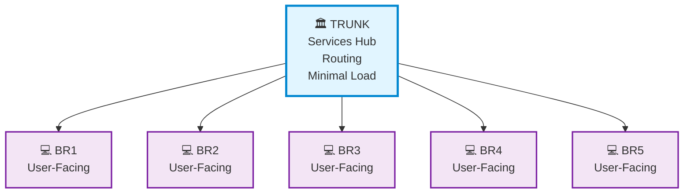

# pyIRCX Server Linking Guide

## Overview

pyIRCX implements a **trunk-branch** (hub-spoke) topology for server linking. This document covers requirements, setup, and important caveats.

## Architecture



**Key Points:**
- ✅ **Trunk hosts services** (Registrar, Messenger, NewsFlash, ServiceBots)
- ✅ **Branches host users** (10K+ users each)
- ✅ **No routing loops possible** (topology prevents them)
- ❌ **No multi-tier** (no branch-to-branch or trunk-to-trunk)
- ❌ **No other IRCds** (pyIRCX-only protocol)

---

## Critical Requirements

### 1. **Exact Version Match (STRICT)**

All linked servers **MUST** run the **EXACT same pyIRCX version**.

```bash
# Check version
python pyircx.py --version

# All servers must show IDENTICAL version metadata
```

**Why:** Prevents protocol mismatches, unexpected behavior, and crashes.

**Failure:** Link will be rejected with error:
```
ERROR :Version mismatch. Remote: 2.0.1, Local: 2.0.2. Versions must match exactly.
```

**Solution:** Upgrade or downgrade all servers to the same version before linking.

---

### 2. **Clock Synchronization with NTP (STRICT)**

All linked servers **MUST** have synchronized clocks within **60 seconds**.

**Why:** Timestamp-based collision resolution requires accurate clocks.
- Nick collisions use timestamps to determine which user is older
- Channel merges use timestamps to determine authoritative state
- Clock skew causes incorrect collision winners

**Strict Limits:**
- **>60 seconds**: Link REJECTED (hard limit)
- **>10 seconds**: Link ALLOWED but WARNING logged

#### Setup NTP (Required)

**Fedora/RHEL/Rocky Linux:**
```bash
# Install chrony
sudo dnf install -y chrony

# Enable and start
sudo systemctl enable --now chronyd

# Verify sync status
sudo chronyc tracking

# Force immediate sync (if needed)
sudo chronyc -a makestep

# Check system time
timedatectl
```

**Debian/Ubuntu:**
```bash
# Install chrony
sudo apt install -y chrony

# Enable and start
sudo systemctl enable --now chrony

# Verify sync status
sudo chronyc tracking

# Force immediate sync (if needed)
sudo chronyc -a makestep

# Check system time
timedatectl
```

**Recommended:**
- Use the **same NTP time source** for all servers (e.g., `pool.ntp.org`)
- Configure NTP **before** attempting to link
- Verify sync: `chronyc tracking` should show "System time: Normal"

**Failure Example:**
```
ERROR :Clock skew 125s exceeds 60s limit. Synchronize clocks with NTP (same time source recommended).
```

---

### 3. **Services Mode Configuration**

**CRITICAL:** Understand services architecture before linking.

#### Trunk Configuration (`config_trunk.json`)

```json
{
  "services": {
    "enabled": true,
    "mode": "centralized",
    "is_services_hub": true,
    "servicebot_count": 10
  },
  "linking": {
    "enabled": true,
    "server_role": "trunk",
    "bind_host": "0.0.0.0",
    "bind_port": 7001,
    "links": [
      {
        "name": "branch1.network.local",
        "host": "10.0.1.10",
        "port": 7002,
        "password": "secure-link-password",
        "autoconnect": false
      }
    ]
  }
}
```

#### Branch Configuration (`config_branch.json`)

```json
{
  "services": {
    "enabled": true,
    "mode": "centralized",
    "is_services_hub": false,
    "hub_server": "trunk.network.local"
  },
  "linking": {
    "enabled": true,
    "server_role": "branch",
    "bind_host": "0.0.0.0",
    "bind_port": 7002,
    "links": [
      {
        "name": "trunk.network.local",
        "host": "10.0.1.1",
        "port": 7001,
        "password": "secure-link-password",
        "autoconnect": true
      }
    ]
  }
}
```

---

## Database and Registration Conflict ⚠️

### The Problem

**Each server has its own separate SQLite database.**

When converting a standalone server to a branch:
- Local database has existing registrations (REGISTER, channels, memos)
- Local database has staff accounts (for server administration)
- Trunk has a separate database
- **Conflict:** Two independent registration systems!

### Critical Distinction: Staff vs Users

**Staff accounts and user registrations serve DIFFERENT purposes:**

| Feature | Purpose | Scope | Location |
|---------|---------|-------|----------|
| **Staff accounts** | Server administration (`/CONFIG`, `/KILL`, etc.) | Local server | **Local DB (each server)** |
| **User registrations** | Network identity (`/REGISTER`, `/IDENTIFY`) | Network-wide | **Trunk DB (centralized)** |

**Key point:** When migrating to centralized services, **KEEP staff accounts local**, clear user registrations.

Each branch needs its own admin accounts for:
- Local `/CONFIG` commands (server-specific settings)
- Local troubleshooting and maintenance
- Emergency access if trunk is down

Operational note:
- Staff accounts remain local to each server
- Staff-issued `/KILL` and other routed actions now propagate across the linked network when appropriate

### Example Scenario

```
Standalone server (before linking):
- Local DB: "alice" registered with password "pass123"
- User "alice" connects and identifies successfully
- Channel #lobby registered to alice

Convert to branch and link to trunk:
- Local DB still has alice registration (orphaned!)
- Trunk DB does not have alice
- New REGISTER commands route to trunk (centralized mode)
- User "alice" tries to identify → trunk DB doesn't recognize alice!
- Channel #lobby registration is only in local DB (invisible to network)
```

### Solutions

**Option A: Keep Staff, Clear Users (Recommended)**
```bash
# Before linking as branch:

# 1. Backup local database
cp branch_pyircx.db branch_pyircx.db.backup

# 2. Export user registrations (optional - if migrating to trunk)
sqlite3 branch_pyircx.db "SELECT * FROM registered_nicks;" > migrate_nicks.sql
sqlite3 branch_pyircx.db "SELECT * FROM registered_channels;" > migrate_channels.sql

# 3. Clear ONLY user-related tables, KEEP staff accounts
sqlite3 branch_pyircx.db <<EOF
DELETE FROM registered_nicks;
DELETE FROM registered_channels;
DELETE FROM memos;
EOF

# 4. Verify staff accounts still exist
sqlite3 branch_pyircx.db "SELECT username, level FROM staff;"

# 5. Configure as branch with centralized services
# 6. Link to trunk

# Result:
# - Local admin access RETAINED (staff table intact)
# - User registrations route to trunk (centralized)
# - Clean separation of concerns
```

**IMPORTANT:** Do NOT delete the entire database or staff table! You need local admin access.

**Option B: Run Local Services Mode (No centralization)**
```json
{
  "services": {
    "enabled": true,
    "mode": "local",  // Not centralized!
    "is_services_hub": false
  }
}
```
- Each server has independent registrations
- Users registered on branch1 are different from branch2
- **Not recommended for networks** (confusing UX)

**Option C: Manual Migration (Advanced)**
```sql
-- Export registrations from branch DB
sqlite3 branch_pyircx.db "SELECT * FROM registered_nicks;"
sqlite3 branch_pyircx.db "SELECT * FROM registered_channels;"

-- Import to trunk DB (manual SQL INSERT)
-- Resolve UUID conflicts manually
-- Not automated - use with caution!
```

### Best Practice

**Start servers in their intended role from day one:**
- Servers intended as branches should be configured as branches from initial deployment
- Don't run standalone with user registrations if you plan to link later
- **Always create local staff accounts** on each server (trunk AND branches)
- Use centralized services mode consistently across the network

### Architecture Clarity

```
Trunk Server:
├── Local Staff DB:
│   ├── admin_trunk (administers trunk server)
│   └── sysop_trunk (assists with trunk)
└── Centralized Services DB:
    ├── User registrations (alice, bob, charlie...)
    ├── Channel registrations (#lobby, #chat...)
    └── Memos (user mailboxes)

Branch Server:
├── Local Staff DB:
│   ├── admin_branch1 (administers branch1 server)
│   └── sysop_branch1 (assists with branch1)
└── Services: Routes to trunk (no local user DB)

User Flow:
- User connects to branch1
- /REGISTER → routed to trunk Registrar service
- /IDENTIFY → routed to trunk Registrar service
- Registration stored in trunk DB

Admin Flow:
- Admin connects to branch1
- /STAFF admin_branch1 password → checks branch1 LOCAL staff table
- /CONFIG SET key value → modifies branch1 LOCAL config
- /KILL localuser → manages branch1 LOCAL users

Network Admin:
- Connect to trunk OR any branch
- Each server has its own admin account
- Network-wide changes require logging into each server
- Alternative: Use same username/password on all servers
```

---

## Stability Features

### Ping/Pong Monitoring

- PING sent every **60 seconds**
- PONG expected within **120 seconds**
- Dead link triggers:
  - Server split notification
  - User QUIT messages
  - Auto-reconnect (if autoconnect enabled)

### SQUIT Propagation

When a server disconnects:
- SQUIT message broadcast to **all other linked servers**
- Ensures network-wide visibility of topology changes
- Prevents partial network views

### EOB (End of Burst)

- Sent after initial state burst completes
- Signals that server is ready for normal traffic
- Tracked per-server with `burst_complete` flag

---

## Firewall Configuration

**On Trunk:**
```bash
# Open linking port
sudo firewall-cmd --permanent --add-port=7001/tcp
sudo firewall-cmd --reload
```

**On Branch:**
```bash
# Open linking port
sudo firewall-cmd --permanent --add-port=7002/tcp
sudo firewall-cmd --reload

# Or allow trunk IP specifically
sudo firewall-cmd --permanent --add-rich-rule='rule family="ipv4" source address="10.0.1.1" port port="7002" protocol="tcp" accept'
sudo firewall-cmd --reload
```

---

## Testing Link

### 1. Start Trunk
```bash
sudo systemctl start pyircx
sudo journalctl -u pyircx -f
```

Look for:
```
Server linking listening on 0.0.0.0:7001
Link monitoring task started
```

### 2. Start Branch (with autoconnect: true)
```bash
sudo systemctl start pyircx
sudo journalctl -u pyircx -f
```

Look for:
```
Connecting to trunk.network.local at 10.0.1.1:7001
Role validation passed: branch <-> trunk
Time sync check for trunk.network.local: delta = 2s
Time sync check passed for trunk.network.local
Sent EOB (End of Burst) to trunk.network.local
```

### 3. Verify on Trunk
```
Incoming server connection from ('10.0.1.10', 54321)
Role validation passed: trunk <-> branch
Version check passed for branch1.network.local
Time sync check passed for branch1.network.local
Received EOB from branch1.network.local - burst complete
```

### 4. Test from IRC Client
```irc
/LINKS
# Should show both servers

/MAP
# Should show network topology

/WHOIS RemoteNick
# Should return a normal WHOIS reply even when the nick is on another linked server

/WHISPER #channel RemoteNick :hello
# Should reach a remote channel member without duplicate delivery
```

---

## Troubleshooting

### Link Rejected: Version Mismatch
```
ERROR :Version mismatch. Remote: 1.2.0, Local: 1.3.0.
```

**Solution:** Upgrade/downgrade to match versions exactly.

### Link Rejected: Clock Skew
```
ERROR :Clock skew 125s exceeds 60s limit.
```

**Solution:**
```bash
# Check time on both servers
date

# Check NTP sync
sudo chronyc tracking

# Force sync
sudo chronyc -a makestep

# Verify timezone
timedatectl
```

### Link Timeout
```
Server handshake timeout from ('10.0.1.10', 54321)
```

**Possible causes:**
- Firewall blocking port
- Wrong IP/port in config
- Network connectivity issue

**Solution:**
```bash
# Test connectivity
telnet trunk-ip 7001

# Check firewall
sudo firewall-cmd --list-ports

# Check logs
sudo journalctl -u pyircx -n 100
```

### Ping Timeout / Split
```
Server branch1.network.local ping timeout (135s since last PONG, limit 120s)
```

**Causes:**
- Network interruption
- Server crashed/killed
- Firewall dropped connection

**Result:** Auto-reconnect triggered (if autoconnect: true)

---

## Security

### Link Passwords

Use strong, random passwords for linking:
```bash
# Generate secure password
openssl rand -base64 32

# Use in config
"password": "UzJ5YmFzZTY0ZW5jb2RlZHBhc3N3b3Jk"
```

### Firewall Rules

**Restrict linking to known IPs:**
```bash
# Only allow trunk IP to connect to branch
sudo firewall-cmd --permanent --add-rich-rule='rule family="ipv4" source address="10.0.1.1" port port="7002" protocol="tcp" accept'

# Remove default allow-all if present
sudo firewall-cmd --permanent --remove-port=7002/tcp
```

---

## Scalability

**Tested Configuration:**
- 1 trunk + 5 branches
- 50,000+ total users
- 2-hop latency (branch → trunk → branch)

**Theoretical Limits:**
- Trunk: 50+ branches (limited by file descriptors, not protocol)
- Network: 500,000+ users (50 branches × 10K each)

**Bottlenecks:**
- Trunk CPU/RAM (handles all routing)
- Network bandwidth (message broadcasts)

**Not a bottleneck:**
- Python/asyncio (I/O bound workload)

---

## See Also

- [CONFIG.md](user/CONFIG.md) - Configuration reference
- [SELINUX.md](user/SELINUX.md) - SELinux configuration
- [INSTALL.md](user/INSTALL.md) - Installation guide
